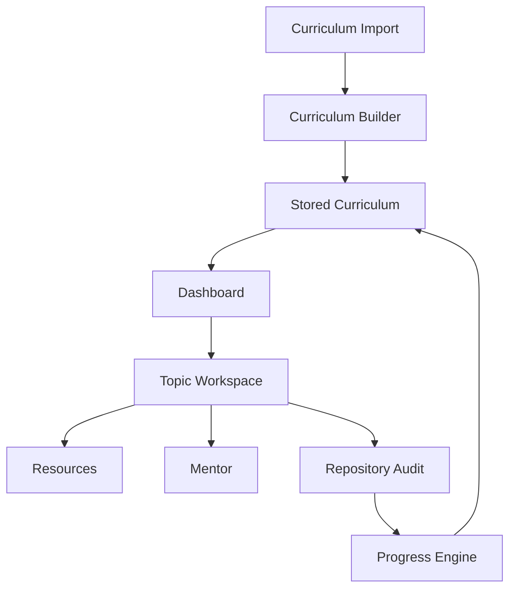

# Engineering Journey

## Curriculum-First Pivot

The active specification in `v2_update.md` reframed Mountain Scope as a curriculum engine. The key engineering change is that the official curriculum becomes the source of truth, while AI-style helpers parse, mentor, recommend resources, and audit implementation evidence.

## Architecture Preserved

The project still uses:

- static dashboard in `public/index.html`
- Vercel serverless API in `api/index.js`
- Supabase JSON storage through `workflow_state`
- shared helper modules in `lib/`
- Custom GPT Action schema in `openapi.yaml`

The architecture was extended with `lib/curriculum.js` rather than replaced.

## New Flow

## Implementation Choices

- Deterministic parsing and auditing were added because no hosted AI provider exists in the current repo.
- Repository audits are evidence-first and conservative.
- Manual override is stored separately from audit data.
- Old workflow states are migrated into curriculum-shaped state where possible.
- The browser keeps local backup behaviour from the previous dashboard.

## Known Boundaries

This implementation prepares the product for AI-backed parsing and auditing, but it does not pretend those providers exist yet. PDF extraction, deep code analysis, and private repository access remain future engineering work.
