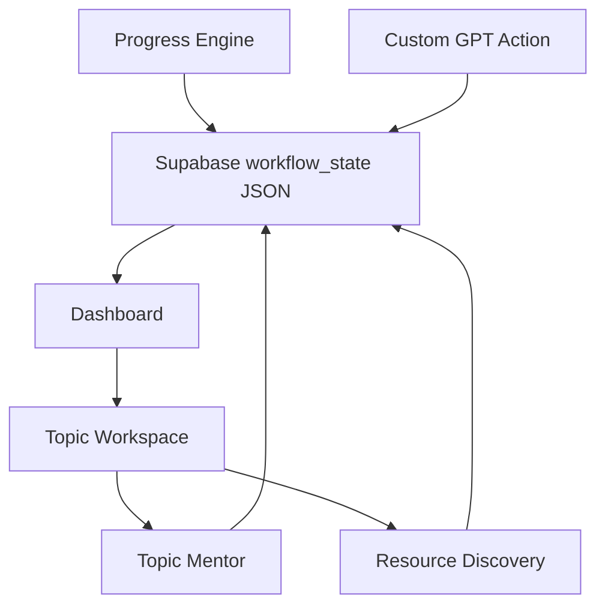

# Mountain Scope

Mountain Scope is an AI-ready curriculum workspace for tracking an interactive learning roadmap.

The curriculum is the source of truth. The dashboard stores phases, projects, topics, learning objectives, deliverables, success criteria, resources, notes, and progress. Topic completion is calculated from topic-level completion data and manual overrides, not estimated from a vague overall feeling.

## Current Implementation

This repository implements the Version 2 curriculum workflow described in `v2_update.md` using the existing Vercel/Supabase architecture.

Implemented now:

- Structured curriculum storage in the existing Supabase-backed workflow JSON.
- Dashboard with overall completion, phase completion, progress intelligence, and selectable topics.
- Topic workspace tabs: Overview, Resources, AI Chat, and Notes.
- Four topic states: `complete`, `partial`, `not_verified`, and `missing`.
- Manual completion override.
- Dynamic resource discovery through AI web search.
- Topic mentor responses generated from selected curriculum, topic criteria, and notes.
- OpenAPI schema for Custom GPT Actions.
- GPT instructions that require ChatGPT to read stored curriculum before advising.

## AI Requirements

Set these server-side environment variables:

- `OPENAI_API_KEY`
- `OPENAI_MODEL`, optional, defaults to `gpt-5.2`

Without `OPENAI_API_KEY`, resource discovery and AI chat return an error. PDF roadmap generation and repository verification have been removed to reduce token usage.

## Architecture



## Project Structure

- `public/index.html` contains the curriculum dashboard and topic workspace.
- `api/index.js` exposes protected workflow, curriculum, mentor, notes, resources, and manual override routes.
- `lib/workflow.js` keeps workflow validation and phase/topic mutations.
- `lib/curriculum.js` contains progress, manual override, and AI orchestration helpers.
- `lib/ai.js` contains Responses API calls, structured output schemas, AI mentoring, and AI resource discovery.
- `openapi.yaml` defines the Custom GPT Action schema.
- `gpt-instructions.md` defines the GPT behaviour rules.
- `supabase.sql` creates the Supabase storage table.
- `tests/workflow.test.js` covers workflow and curriculum helper behaviour.
- `v2_update.md` is the primary implementation specification.

## Setup

Install dependencies:

```bash
npm install
```

Create a Supabase project, then run `supabase.sql` in the Supabase SQL editor. Copy the project URL and service-role key.

Configure these environment variables in Vercel:

- `SUPABASE_URL`
- `SUPABASE_SERVICE_ROLE_KEY`
- `OPENAI_API_KEY`
- optional `OPENAI_MODEL`

Deploy the project to Vercel. AI features use the server-side `OPENAI_API_KEY`; the browser does not ask users for OpenAI or workflow API keys.

## Connect ChatGPT

1. Create a Custom GPT in ChatGPT.
2. Copy `gpt-instructions.md` into the GPT instructions.
3. Enable Actions.
4. Confirm `openapi.yaml` points at the deployed Vercel API.
5. Paste the schema into the Action schema field.
6. Leave authentication disabled unless you add a separate server-side access-control layer.

## Local Verification

Run tests with Node 18 or newer:

```bash
npm test
```

Run locally through Vercel:

```bash
npm run dev
```

## Security Notes

- The Supabase table has Row Level Security enabled.
- No public Supabase policies are created by `supabase.sql`.
- The service-role key should only live in server-side environment variables.
- The OpenAI key should only live in server-side environment variables.
- The dashboard never stores or prompts for OpenAI or workflow API keys.

## Remaining Limitations

- PDF roadmap generation and repository verification are intentionally removed to keep token usage low.
- Roadmap changes should be made through ordinary workflow/topic edits or full workflow replacement.
