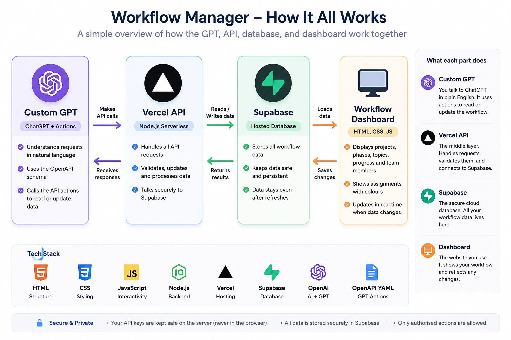

# Mountain Scope

Mountain Scope is a workflow dashboard for planning and tracking a project roadmap. It keeps phases, topics, team members, assignments, notes, resources, and completion status in one stored workflow.

The app is intentionally simple: a browser dashboard, a small Vercel API, Supabase storage, and an OpenAPI file that lets a Custom GPT call the same API.

## Tech Stack

The tech stack is the set of tools and technologies used to build the project.

- HTML, CSS, and JavaScript build the dashboard in `public/index.html`.
- Node.js runs the backend code in `api/index.js` and `lib/`.
- Vercel hosts the dashboard and the serverless API route.
- Supabase stores the workflow data in the `workflow_state` table.
- OpenAPI describes the API actions in `openapi.yaml` and `public/openapi.yaml`.
- Custom GPT Actions let ChatGPT read and update the workflow through the API.
- npm runs project scripts like `npm run dev` and `npm test`.
- GitHub is used for source control.
- Automated tests live in `tests/` and use Node's built-in test runner.

The tech stack describes what the project is built with, while the architecture explains how those technologies work together.

## Architecture

Architecture means how the different parts of the project are organised and how they talk to each other.

```text
User
  ↓
Dashboard or Custom GPT
  ↓
Vercel API
  ↓
Supabase
```

The dashboard is the visual interface. It displays the workflow in the browser and lets a user edit phases, topics, team members, assignments, notes, and completion state.

The Custom GPT is the natural-language interface. It can read and update the same workflow through ChatGPT Actions.

Vercel hosts both the dashboard and the Node.js API. Requests to `/api/*` are routed to `api/index.js`.

The API validates requests and controls workflow changes before writing anything. Supabase stores the workflow data so it remains after refreshes and can be shared between interfaces.

The OpenAPI schema tells the Custom GPT which API actions it can call. Both the dashboard and the Custom GPT use the same API and the same Supabase storage, so a change made in one place should appear in the other.

## Dashboard Frontend

The frontend is a plain HTML/CSS/JavaScript app in `public/index.html`. There is no separate frontend framework.

It renders the roadmap, team filter, phase and topic controls, topic workspace, notes, resources, and assignment indicators. It talks to the API with `fetch`, then keeps a local backup in `localStorage` if the API is unavailable.

## Vercel API

The backend entry point is `api/index.js`. Vercel rewrites `/api/:path*` to this file using `vercel.json`.

The API supports workflow reads and writes, phase and topic edits, assignment actions, progress reads, notes, manual completion overrides, resource discovery, and topic mentor replies.

Most workflow validation and mutation logic lives in `lib/workflow.js`. Curriculum progress, notes, manual overrides, resources, and mentor helpers live in `lib/curriculum.js`, `lib/resource-search.js`, and `lib/ai.js`.

## Supabase Storage

Supabase stores one workflow record in `public.workflow_state`. The API reads and writes the `data` JSON column using the Supabase service-role key on the server.

`supabase.sql` enables Row Level Security and does not create public policies. The service-role key should stay in server-side environment variables only.

## Custom GPT And OpenAPI

The important schema files are:

- `openapi.yaml` for the Custom GPT Action schema.
- `public/openapi.yaml` for the public copy served with the dashboard.

These files should stay in sync. They describe operations such as `getWorkflow`, phase and topic updates, assignment updates, notes, resources, and manual status overrides.

`gpt-instructions.md` contains behaviour guidance for the Custom GPT. The GPT should read the latest workflow before making changes, then call the API using IDs from that response.

## Project Structure

- `public/index.html` contains the dashboard UI.
- `public/client-response.js` contains shared response parsing for browser API calls.
- `api/index.js` exposes the Vercel API route.
- `lib/workflow.js` handles workflow validation, normalization, phase/topic changes, and team assignments.
- `lib/curriculum.js` handles progress, notes, manual overrides, resources, and mentor orchestration.
- `lib/ai.js` calls the OpenAI Responses API for AI-assisted resource and mentor features.
- `lib/resource-search.js` helps find topic resources.
- `openapi.yaml` and `public/openapi.yaml` describe the GPT Actions.
- `gpt-instructions.md` contains Custom GPT instructions.
- `supabase.sql` creates the Supabase storage table.
- `tests/*.test.js` contains the Node test suite.

## Setup

Install dependencies:

```bash
npm install
```

Create a Supabase project, then run `supabase.sql` in the Supabase SQL editor.

Set these server-side environment variables in Vercel:

- `SUPABASE_URL`
- `SUPABASE_SERVICE_ROLE_KEY`

AI-assisted resource discovery and mentor replies also need:

- `OPENAI_API_KEY`
- `OPENAI_MODEL`, optional

Run locally through Vercel:

```bash
npm run dev
```

Run tests:

```bash
npm test
```

## Connect ChatGPT

1. Create a Custom GPT in ChatGPT.
2. Copy `gpt-instructions.md` into the GPT instructions.
3. Enable Actions.
4. Confirm `openapi.yaml` points at the deployed Vercel API.
5. Paste the schema into the Action schema field.
6. Leave authentication disabled unless you add a separate access-control layer.

## Security Notes

- The Supabase service-role key should only be used by the server-side API.
- The OpenAI key should only live in server-side environment variables.
- The browser does not ask users for Supabase or OpenAI keys.
- `supabase.sql` does not create public Supabase access policies.

