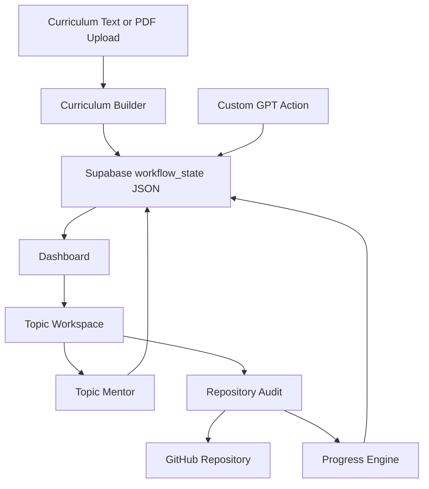

# Mountain Scope

Mountain Scope is an AI-ready curriculum engine that turns structured curriculum material into an interactive learning roadmap.

The curriculum is the source of truth. The dashboard stores phases, projects, topics, learning objectives, deliverables, success criteria, resources, notes, audits, and progress. Topic completion is calculated from topic-level completion data and manual overrides, not estimated from a vague overall feeling.

## Current Implementation

This repository implements the Version 2 curriculum workflow described in `v2_update.md` using the existing Vercel/Supabase architecture.

Implemented now:

- Curriculum Builder for pasted curriculum text and best-effort uploaded text/PDF reading in the browser.
- Structured curriculum storage in the existing Supabase-backed workflow JSON.
- Dashboard with overall completion, phase completion, progress intelligence, and selectable topics.
- Topic workspace tabs: Overview, Resources, AI Chat, Verify, and Notes.
- Four topic states: `complete`, `partial`, `not_verified`, and `missing`.
- Manual completion override that remains separate from audit verification.
- Dynamic resource links generated from the selected topic and keywords.
- Topic mentor responses based on stored curriculum context and previous audit data.
- Evidence-first repository audit endpoint for public GitHub repositories.
- OpenAPI schema for Custom GPT Actions.
- GPT instructions that require ChatGPT to read stored curriculum before advising.

## Important Boundaries

The current implementation includes deterministic local engines and API endpoints. It does not yet include a hosted model provider, OCR-quality PDF extraction, or deep semantic code analysis. Repository audits inspect public GitHub metadata, README content, and file paths, then compare that evidence against stored topic criteria.

## Architecture



## Project Structure

- `public/index.html` contains the curriculum dashboard and topic workspace.
- `api/index.js` exposes protected workflow, curriculum, mentor, audit, notes, resources, and manual override routes.
- `lib/workflow.js` keeps workflow validation and phase/topic mutations.
- `lib/curriculum.js` contains curriculum parsing, progress calculation, mentoring, resources, manual override, and audit helpers.
- `openapi.yaml` defines the Custom GPT Action schema.
- `gpt-instructions.md` defines the GPT behaviour rules.
- `supabase.sql` creates the Supabase storage table.
- `tests/workflow.test.js` covers workflow and curriculum helper behaviour.
- `v2_update.md` is the primary implementation specification.

## Setup

Install dependencies:

```bash
npm install
```

Create a Supabase project, then run `supabase.sql` in the Supabase SQL editor. Copy the project URL and service-role key.

Create a private workflow API key:

```bash
openssl rand -hex 32
```

Configure these environment variables in Vercel:

- `SUPABASE_URL`
- `SUPABASE_SERVICE_ROLE_KEY`
- `WORKFLOW_API_KEY`

Deploy the project to Vercel. When the dashboard first opens, it asks for `WORKFLOW_API_KEY`.

## Connect ChatGPT

1. Create a Custom GPT in ChatGPT.
2. Copy `gpt-instructions.md` into the GPT instructions.
3. Enable Actions.
4. Confirm `openapi.yaml` points at the deployed Vercel API.
5. Paste the schema into the Action schema field.
6. Set authentication to API Key, bearer format.
7. Use the same `WORKFLOW_API_KEY`.

## Local Verification

Run tests with Node 18 or newer:

```bash
npm test
```

Run locally through Vercel:

```bash
npm run dev
```

## Security Notes

- The Supabase table has Row Level Security enabled.
- No public Supabase policies are created by `supabase.sql`.
- The service-role key should only live in server-side environment variables.
- Every API request requires the private bearer key.
- The dashboard stores the private workflow API key in browser local storage after it is entered.

## Remaining Limitations

- Uploaded PDFs are read with browser text reading only; scanned PDFs need OCR or a real PDF extraction service.
- The mentor is deterministic unless a Custom GPT calls the API and reasons over the returned data.
- Repository audits are evidence-based but shallow: metadata, README content, and file paths.
- Private GitHub repository auditing is not implemented.
- Automatic curriculum difference review is implemented at the API helper level, but the browser import flow replaces the active curriculum directly.
