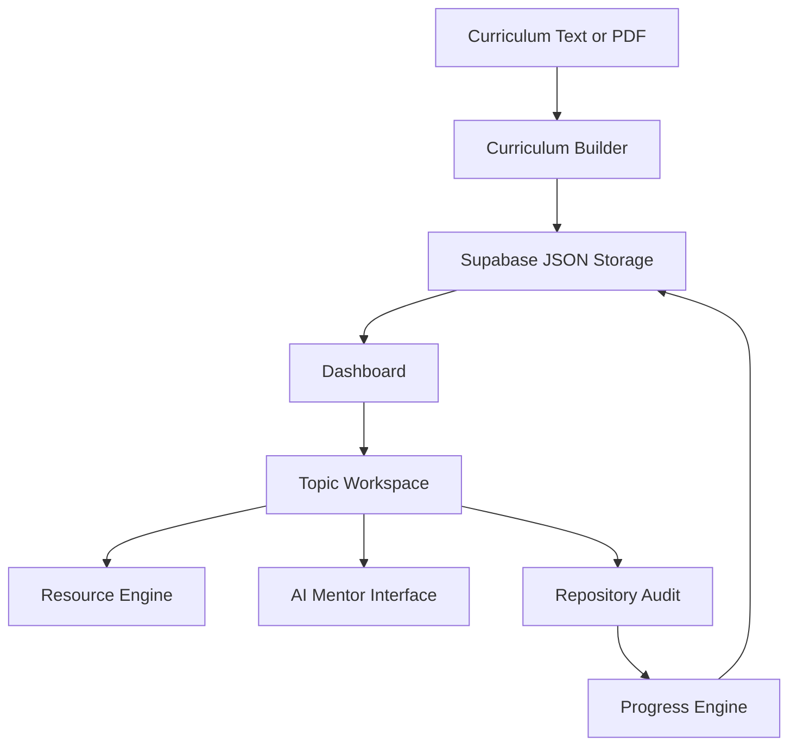

# Mountain Scope Product Specification

`v2_update.md` is the primary specification for the active product.

## Product Vision

Mountain Scope is a curriculum-driven learning operating system. It imports structured curriculum material, stores it as the source of truth, opens a workspace for each topic, recommends resources, provides topic mentoring, verifies implementation against GitHub evidence, and calculates progress from topic completion.

## Source of Truth

The curriculum is authoritative. AI may parse, mentor, recommend, and audit, but it must not invent objectives or completion criteria.

## Implemented Product Scope

- AI curriculum import from pasted text or uploaded PDF/file data.
- Structured curriculum JSON with phases, projects, topics, objectives, deliverables, success criteria, keywords, glossary, resources, and version history.
- Dashboard roadmap with overall and phase-level progress.
- Topic states: `complete`, `partial`, `not_verified`, `missing`.
- Topic workspace: Overview, Resources, AI Chat, Verify, Notes.
- Static resources from import plus dynamic AI web-search resource discovery.
- Personal notes that do not modify the official curriculum.
- Evidence-first repository audit that analyses actual source files, README content, and repository metadata.
- Manual override recorded separately from audit verification.
- Progress intelligence: strongest topics, needs improvement, recommended next topic, estimated remaining work.
- Custom GPT Action schema and behaviour instructions.

## Architecture

## API Surface

- `GET /api/workflow`
- `PUT /api/workflow`
- `GET /api/curriculum`
- `POST /api/curriculum/import`
- `GET /api/progress`
- `POST /api/phases`
- `POST /api/topics`
- `PATCH /api/topics/{topicId}`
- `GET /api/topics/{topicId}/resources`
- `POST /api/topics/{topicId}/mentor`
- `POST /api/topics/{topicId}/audit`
- `PATCH /api/topics/{topicId}/notes`
- `PATCH /api/topics/{topicId}/manual-override`

## Current Technical Limits

- `OPENAI_API_KEY` is required for import, mentoring, resources, and audit.
- Repository audits sample source files to stay within model context limits.
- Private GitHub repository access requires `GITHUB_TOKEN`.
